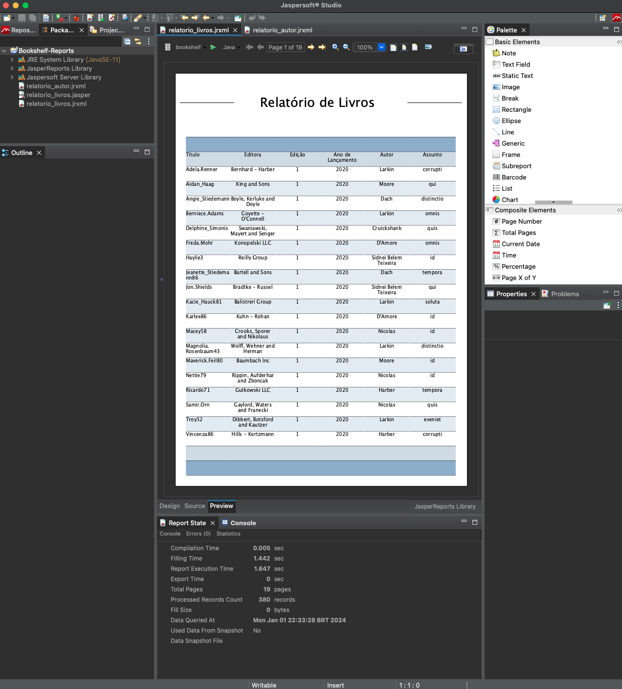
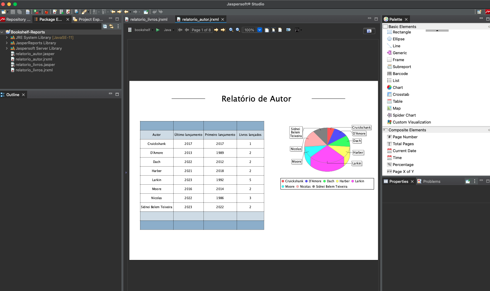

# Bookshelf

Este projeto foi feito da forma mais basica e corrida possível, não utilizando melhores praticas e organizando projetos em camadas ou utilzando patterns.

Contém diversos pontos para validação e tratamento de erros, todo o CRUD está pronto faltando apenas maquiagem no front.

API de backend construido com laravel Sail para rodar o framework usando docker-compose, utilizando o comando abaixo para iniciar o projeto.

```bash
curl -s "https://laravel.build/bookshelf" | bash
```

Frontend feito com React.JS sem typescript utilizando o comando abaixo para iniciar o projeto.

```bash
npx create-react-app bookshelf-front
```

Para subir todo o ambiente basta rodar o comando abaixo

```bash
docker-compose up -d
```

Para desmontar o ambiente

```bash
docker-compose down
```

Link do frontend →  [http://localhost:3000](http://localhost:3000)

Paths das API`s, no projeto contém a collection para testes utilizando o [ Postman](./Bookshelf.postman_collection.json).

| http://localhost/api/books   |
| ---------------------------- |
| http://localhost/api/authors |
| http://localhost/api/topics  |


Relatório criado usando Jasper Reports, abaixo prints das telas criadas.


